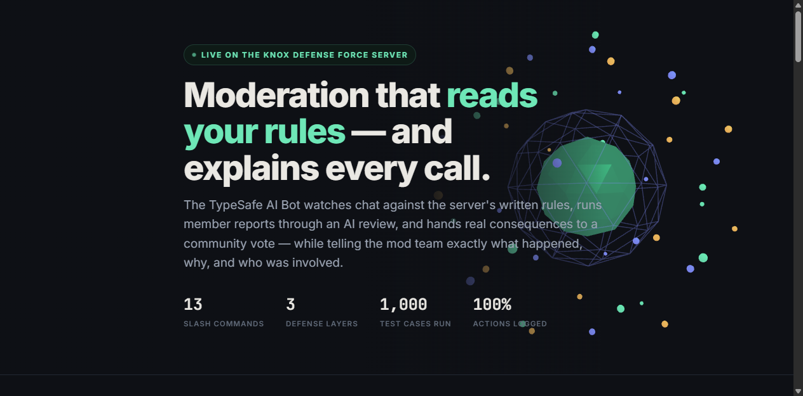

# TypeSafe AI Bot

**A self-hosted Discord moderation bot that reads your written rules, has an AI
suggest — and lets plain code decide.** Every action is logged, explained, and
(when it matters) put to a community vote.

> 🎬 **[▶ Watch the 2-minute demo reel on the product page](https://therocksss.github.io/typesafe-ai-bot/)**
> — plays right there, with clickable chapters. 1080p, narrated.
> (Direct file: [demo-reel-v3.mp4](docs/img/demo-reel-v3.mp4) · [storyboard source](docs/demo-reel-v3.html))



Built for a real multi-game community server and generalized for self-hosting:
Discord IDs are config, not constants, and `DRY_RUN` defaults to **watch-first**
so a fresh clone can never enforce before you choose to.

## Demo

| | |
|---|---|
| 🎬 **[▶ Watch the reel](https://therocksss.github.io/typesafe-ai-bot/#demo)** | 2-min narrated tour with clickable chapters, on the live product page · [raw file](docs/img/demo-reel-v3.mp4) |
| 🖼️ [Cases view](docs/img/demo-cases.png) | every decision with action, kind, reason, mode |
| 🖼️ [Votes view](docs/img/demo-votes.png) | live vote tallies with thresholds |
| 🖼️ [How a decision is made](docs/img/briefing-pipeline.png) | the 4-step chain |
| 🖼️ [A vote in Discord](docs/img/briefing-vote.png) | the embed members actually see |

## Why this exists

Manual moderation doesn't scale: rule enforcement is inconsistent, spam floods
land while mods sleep, compromised-admin nukes get noticed minutes too late, and
member reports die in DMs. This bot automates the **watching**, keeps the
**decisions** explainable, and gives the community a **voice** — while humans
keep the veto.

## How a decision is made

```
message ──► 1. screened against every enabled rule in ONE batched AI call
        ──► 2. AI returns a probability per rule — never a punishment
        ──► 3. confidence bands:  ≥0.85 act · ≥0.60 review · below logged
        ──► 4. action + case record with names, reason, and owner notification
```

The AI only supplies a probability. Every threshold, action, and failure mode is
owned by plain code (`src/tsabot/policy.py`, `detectors.py`, `actions.py`) — you
can read exactly why anything happened, and the case log always says.

**Fail-safe chain:** TypeSafe Jev → OpenCode CLI (free Jev) → heuristics + human
review. A circuit breaker trips after repeated failures and auto-recovers;
outages are visible in `/jev` and the dashboard, never silent. No API key? The
bot still works as a heuristics + review + votes bot and never auto-punishes.

## What it does

- **Chat automod** — every message screened against `policy/rules.json` (6 sample
  rules — replace with yours) in one batched judge call. High-confidence
  violations act (watch-first by default); medium-confidence route to owners.
- **Member reports → community votes** — `/report` requires a written reason;
  the AI validates report quality (anti-flood: 5/day cap, ≥12 chars, 3 invalid
  reports in 7 days revokes reporting rights). Valid reports open a vote:
  *[Mute 1h] [Disconnect] [No action]* — passes at **≥5 votes and ≥60 %** within
  10 minutes, staff may `/veto`, the AI reviews the outcome before it applies.
- **Spam / rate protection** — burst, duplicate, mass-mention and link-flood
  windows (10-minute rolling) → timeout + channel notice + owner notification.
- **Anti-nuke** — audit-log watcher: rogue mass-deletes/bans/kicks/webhook
  creation → privilege strip + lockdown + owner alerts.
- **Case log** — every decision recorded with action, kind, target, reason and
  mode (LIVE/watch). Filterable in the dashboard; `/recent` in Discord.
- **Notification routing** — `log` (default: mod-log channel) / `dm` / `both`.
  Critical alerts always reach owners.
- **Role → capability permissions** — `/setup` select-menu panel maps Discord
  roles to capabilities (`/perms` shows the matrix; `/me` shows your own).
- **Dashboard** — dark read-only control panel on `127.0.0.1:8788`: Overview,
  Judge chain, Cases (+ detail routes), Votes (+ detail), Load test, Rulebook,
  Scheduler & owners, Command guide — 20+ JSON/HTML endpoints, live data badges.

## Slash commands (17)

| Everyone | Moderators | Owners / staff |
|---|---|---|
| `/report` report a member (reason required) | `/case @user` full history | `/veto` cancel an open vote |
| `/recent` newest cases (ephemeral) | `/warn` · `/mute` (1 h, auto-lift) · `/disconnect` | `/config` view/set config |
| `/me` my capabilities | `/panel` quick moderation panel | `/setup` role→capability panel · `/perms` matrix |
| `/votes` open votes | `/status` uptime, mode, judge health | `/jev` judge chain: model, spend, outage state |
| `/help` | `/notify` check/change routing | (multiple owners via config) |

## Quick start

```bash
git clone <this-repo> && cd typesafe-ai-bot
python -m venv .venv && .venv/Scripts/activate   # or source .venv/bin/activate
pip install -r requirements.txt

python -m pytest tests/ -q        # 89 tests — proves the install
cp .env.example .env              # fill DISCORD_TOKEN / DISCORD_GUILD_ID / OWNER_IDS
python src/main.py                # bot (DRY-RUN: watches, nothing enforced)
python src/dashboard_main.py      # dashboard → http://127.0.0.1:8788
```

Then run it in watch-only mode for a week, tune `policy/rules.json`, and set
`DRY_RUN=0` deliberately when you trust it. Full walkthrough with verify-steps —
Discord app creation → permissions → review week → going live → troubleshooting:
**[docs/SETUP.md](docs/SETUP.md)**.

## Configuration

Everything comes from `.env` (gitignored; see `.env.example` — 26 keys, all
optional except the three IDs). Key defaults:

| Knob | Default | Env |
|---|---|---|
| Enforcement mode | **watch-first** (`DRY_RUN=True`) | `DRY_RUN` |
| Act / review bands | 0.85 / 0.60 | `AUTOMOD_HIGH` / `AUTOMOD_MEDIUM` |
| Vote to pass | ≥5 votes, ≥60 %, 10 min | `VOTE_MIN` / `VOTE_PCT` / `VOTE_MINUTES` |
| Report anti-abuse | 5/day, ≥12 chars, 3 strikes/7 d | `REPORT_DAILY_CAP` etc. |
| Notification routing | `log` (mod-log channel) | `NOTIFY_MODE` |
| Judge | `jev-latest`, 60 calls/min cap, breaker | `JEV_MODEL`, `TYPESAFE_API_KEY` |
| Dashboard | `127.0.0.1:8788`, read-only | `DASHBOARD_PORT` |

## Layout

```
src/main.py               bot entrypoint        src/dashboard_main.py  dashboard entrypoint
src/tsabot/
  bot.py cogs/            discord.py bot: automod, spam, antinuke, reports, cases,
                          notify, setup panel, status, owners, info
  judge/                  Jev client + OpenCode fallback + circuit breaker
  policy.py detectors.py  rule evaluation + heuristic floor
  actions.py caps.py      enforcement + role→capability system
  db.py vote_logic.py scheduler.py notifier.py  storage, votes, scheduling, routing
  dashboard/              FastAPI + prebuilt React 19 control panel
policy/rules.json         the machine-readable rulebook (replace with your rules)
tests/                    89 unit + mocked-Discord integration tests
docs/SETUP.md             self-hosting guide · docs/SPEC.md  spec (37 user stories)
docs/img/…                reel + screenshots above
tools/judge_selftest.py   live Jev API evidence tool
tools/loadtest/           1,000-case detection harness (used for the badge above)
```

## Tested, not hoped

- **89 automated tests** (`pytest -q`) — policy bands, vote math, rate windows,
  judge degradation (keyless / 402 / breaker trip+recover), permissions,
  anti-nuke logic, mocked-Discord integration flows. CI runs them on every push.
- **1,000-case load test** — detection harness (`tools/loadtest/`) against the
  heuristic floor: spam floods, nukes, doxxing/threat/self-harm phrasing.
- **Live-server validated** — the automod catch in the demo reel is a real
  recorded case from the community server, not staged data.

## Secrets & safety model

- `.env` holds every secret (Discord token, API keys). Never commit it. The
  `.env.example` ships placeholders only.
- Dashboard binds `127.0.0.1` — local-only, read-only.
- Single-guild by design; the bot cannot touch other servers.
- Nothing enforces until you set `DRY_RUN=0`. Even live: no AI verdict acts
  without crossing a code-owned band, and owners can veto.

## Documentation

- **[docs/SETUP.md](docs/SETUP.md)** — complete self-hosting guide
- [docs/SPEC.md](docs/SPEC.md) — spec: 37 user stories + testing decisions
- [docs/briefing.html](docs/briefing.html) — visual architecture briefing
- [CONTRIBUTING.md](CONTRIBUTING.md) — dev setup, test expectations, PR norms

## License

MIT — see [LICENSE](LICENSE). Built for a real community server, now open for
yours.
